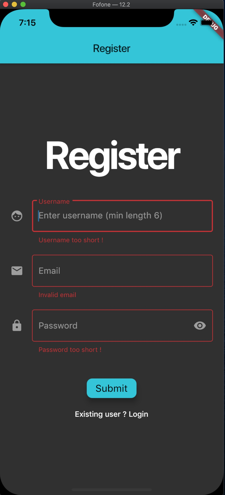

# Flutter Stripe

A full-stack e-commerce mobile application from scratch, with a complete shopping cart for authenticated users as well an entire customer checkout.

Complete app with an eye-catching UI using :  
-Flutter Material Library  
-Redux for global state management  
-Redux Thunk for async actions  
-Complete API with custom controllers with the help of Strapi  
-App data stored in a cloud MongoDB Atlas database  
-User Authentication with Register / Login.

